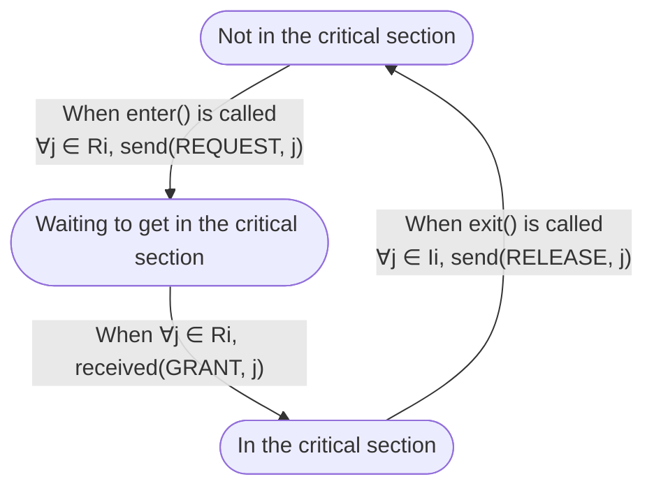

# Distributed Algorithms Assignments

## About

This repository is dedicated to assignments given by professor [Markus Endler](https://www-di.inf.puc-rio.br/~endler/) in the Distributed Algorithms course ([INF2056](https://www-di.inf.puc-rio.br/~endler/courses/DA/index.html)) at the [Pontifical Catholic University of Rio de Janeiro](https://www.puc-rio.br/english/) during the 1st semester of 2022.
Every assignment will consist of implementating some distributed algorithm on Sinalgo (see "Credits" section). I'll be using Sinalgo version 0.75.3 (which can be obtained on [this](https://sourceforge.net/projects/sinalgo/) Sourceforge page) simply because I could not manage to run the newer versions on Eclipse. :-)

## Distributed Mutual Exclusion Algorithms (Sanders, 1987)

Every process `i` in the generalized algorithm is in one of the following three states. We denote the request set of process `i` by `Ri` and its inform set by `Ii`.

One can observe from the state machine that for any `j` that satisfies `j ∈ Ri ∩ Ii`:

* If `j` received a `REQUEST` from `i`, but `j` has not sent a `GRANT` back yet, then `j` can assume that `i` is waiting to get in the CS.
* If `j` sent a `GRANT` to `i`, but `j` has not received `RELEASE` back yet, then `j` assumes `i` to be in the CS.
* If none of the above are true, then `j` assumes `i` NOT to be in the CS.

## Credits

 Sinalgo was developed by the [Distributed Computing Group](http://disco.ethz.ch/) at [ETH Zurich](http://www.ethz.ch/).
