# Distributed Algorithms Assignments

## About

This repository is dedicated to assignments given by professor [Markus Endler](https://www-di.inf.puc-rio.br/~endler/) in the Distributed Algorithms course ([INF2056](https://www-di.inf.puc-rio.br/~endler/courses/DA/index.html)) at the [Pontifical Catholic University of Rio de Janeiro](https://www.puc-rio.br/english/) during the 1st semester of 2022.
Every assignment will consist of implementating some distributed algorithm on Sinalgo (see "Credits" section). I'll be using Sinalgo version 0.75.3 (which can be obtained on [this](https://sourceforge.net/projects/sinalgo/) Sourceforge page) simply because I could not manage to run the newer versions on Eclipse. :-)

## Distributed Mutual Exclusion Algorithms (Sanders, 1987)

Every process in the generalized algorithm is in one of the following three states:

```mermaid
%% State machine for processes in Sanders87
graph TB
    %% States
    NotInCS([Not in the critical section])
    Waiting([Waiting to get in the critical section])
    InCS([Inside the critical section])
    %% Transitions
    NotInCS -- "send(REQUEST, R ∪ I)" --> Waiting
    Waiting -- "receive(GRANT, R)" --> InCS
    InCS -- "send(RELEASE, I)" --> NotInCS
```

## Credits

 Sinalgo was developed by the [Distributed Computing Group](http://disco.ethz.ch/) at [ETH Zurich](http://www.ethz.ch/).
